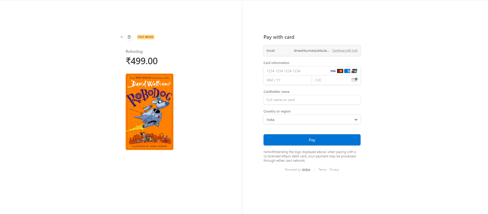

# Online Bookstore E-commerce Application

This project is a microservices-based e-commerce platform designed for an online bookstore. The system is built to handle book browsing, ordering, secure payments, authentication, and real-time notifications in a highly scalable and modular architecture.

## Table of Contents

- [Technologies Used](#technologies-used)
- [Architecture Overview](#architecture-overview)
- [Setup Instructions](#setup-instructions)
- [Key Features](#key-features)
- [API Gateway](#api-gateway)
- [Services](#services)
- [Contributing](#contributing)
- [License](#license)

## Technologies Used

- **Frontend:** React.js, Tailwind CSS
- **Backend:**
  - Spring Boot (Order Service)
  - Node.js (Book Service)
  - Flask (Payment Service with Stripe integration)
  - Gin (Authentication Service with JWT)
  - Python & Redis (Notification Service)
- **Database:** MySQL
- **API Gateway:** For communication between services

## Architecture Overview

The application is composed of multiple microservices, each responsible for a specific business function:

- **Order Service** (Spring Boot): Handles all order-related operations.
- **Book Service** (Node.js): Manages CRUD operations for books.
- **Payment Service** (Flask): Integrates Stripe for payment processing.
- **Authentication Service** (Gin): Secures user login and registration with JWT.
- **Notification Service** (Python, Redis): Sends real-time notifications to users.
- **API Gateway:** Centralizes communication, ensuring seamless interaction between the frontend and backend services.

## Setup Instructions

### Prerequisites

- **Node.js** (v16.x or higher)
- **Java** (v11 or higher)
- **Go** (v1.16 or higher)
- **Python** (v3.8 or higher)
- **MySQL** (v8.x)
- **Redis**

### Installation

1. Install frontend dependencies:

   ```bash
   git clone https://github.com/kalyanKumarPokkula/online-book-store.git
   cd online-book-store
   npm install
   ```

2. Install and configure each microservice:

   - **Order Service (Spring Boot)**:

     - Navigate to the `order-service` directory and build the project using Maven or Gradle.

     ```bash
     git clone https://github.com/kalyanKumarPokkula/orderservice.git
     cd orderservice
     ./mvnw clean install
     mvnw build
     ```

   - **Book Service (Node.js)**:

     - Navigate to the `book-service` directory and install the dependencies.

     ```bash
     git clone https://github.com/kalyanKumarPokkula/online-book-store-backend.git
     cd online-book-store-backend
     npm install
     npm run dev

     ```

   - **Payment Service (Flask)**:

     - Navigate to the `payment-service` directory and install the dependencies.

     ```bash
     git clone https://github.com/kalyanKumarPokkula/Payment-service.git
     cd payment-service
     pip install -r requirements.txt
     python app.py
     ```

   - **Authentication Service (Gin)**:

     - Navigate to the `auth-service` directory and build the project.

     ```bash
     git clone https://github.com/kalyanKumarPokkula/User-Authentication.git
     cd user-authentication
     go build
     go run main.go
     ```

   - **Notification Service (Python)**:

     - Navigate to the `notification-service` directory and build the project.

     ```bash
     git clone https://github.com/kalyanKumarPokkula/Notification-Service.git
     cd notification-service
     pip install -r requirements.txt
     python app.py

     ```

   - **Api-Gateway Service (Python)**:

     - Navigate to the `Api-Gateway-service` directory and build the project.

     ```bash
     git clone https://github.com/kalyanKumarPokkula/Api-Gateway-Service.git
     cd Api-Gateway-Service
     npm install
     npm run dev

     ```

3. Set up **MySQL** database:

   - Create a new MySQL database and update the connection details in each service’s configuration file.

4. Start the services:

   - Start Redis for the notification service.
   - Run each service individually by navigating to their respective directories and running the appropriate start command.

5. Run the API Gateway.

6. Finally, start the frontend by running:

   ```bash
   cd bookstore
   npm run dev

   ```

## Key Features

- **Microservices Architecture:** Each core business function is decoupled into separate services, making the application scalable and maintainable.
- **Secure Payments with Stripe:** Payments are handled securely via Stripe's API.
- **JWT Authentication:** Secure user access and authorization using JSON Web Tokens.
- **Real-time Notifications:** Notifications are delivered using Redis for real-time updates.
- **API Gateway:** A centralized gateway for seamless communication between frontend and backend services.

## API Gateway

The API Gateway serves as a single entry point for client requests, simplifying service discovery and routing. It also handles concerns like authentication, rate-limiting, and load balancing between services.

## Services

1. **Order Service (Spring Boot)**

   - Handles all order-related functions like placing, updating, and viewing orders.

2. **Book Service (Node.js)**

   - Manages book listings, including adding, updating, viewing, and deleting books.

3. **Payment Service (Flask)**

   - Integrates Stripe for secure payments.

4. **Authentication Service (Gin)**

   - Provides user authentication with JWT-based access control.

5. **Notification Service (Python & Redis)**
   - Delivers real-time notifications related to orders and updates.

# Online Bookstore E-commerce Application

This project is a microservices-based e-commerce platform designed for an online bookstore.

## Screenshots

### Homepage


### Book Listing Page


### Book Details Page


### Top50 Page


### Search Page


### Checkout Page


### Cart page


### login Page


### signup page


### Payment Page



## Contributing

Contributions are welcome! Please follow the standard Git flow for submitting pull requests and ensure that code is properly documented.

1. Fork the repository
2. Create a new branch (`git checkout -b feature-branch`)
3. Commit your changes (`git commit -am 'Add new feature'`)
4. Push the branch (`git push origin feature-branch`)
5. Submit a pull request

## License

This project is licensed under the MIT License. See the [LICENSE](LICENSE) file for more details.
